# Trained Models

In this folder, we load some example trained models. They are:
* bsld/lublin256: synthetic trace generated based on Lublin model
* bsld/Lublin256new: another synthentic trace generated based on Lublin model
* bsld/hpc2n: real-world workloads from SWF archive
* bsld/sdsc_sp2: real-world workload from SWF archive

Note that, these models were trained based on average bounded job slowdown.

* utilization/lublin256: synthetic trace generated based on Lublin model
* utilization/Lublin256new: another synthentic trace generated based on Lublin model
* utilization/hpc2n: real-world workloads from SWF archive
* utilization/sdsc_sp2: real-world workload from SWF archive

Note that, these models were trained based on resource utilization.

# Model Performance
We summarize the performance of these models in training and actually scheduling the jobs.

| Models                                  | lublin256                      | Lublin256new            | hpc2n                            | sdsc_sp2                            |
|-----------------------------------------|------------------------------------------|---------------------------------------------|--------------------------------------|-----------------------------------------|
| Training curve                          | 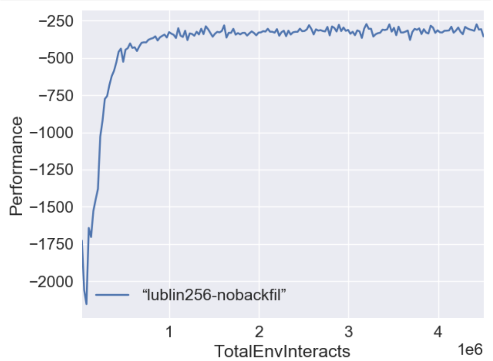 | 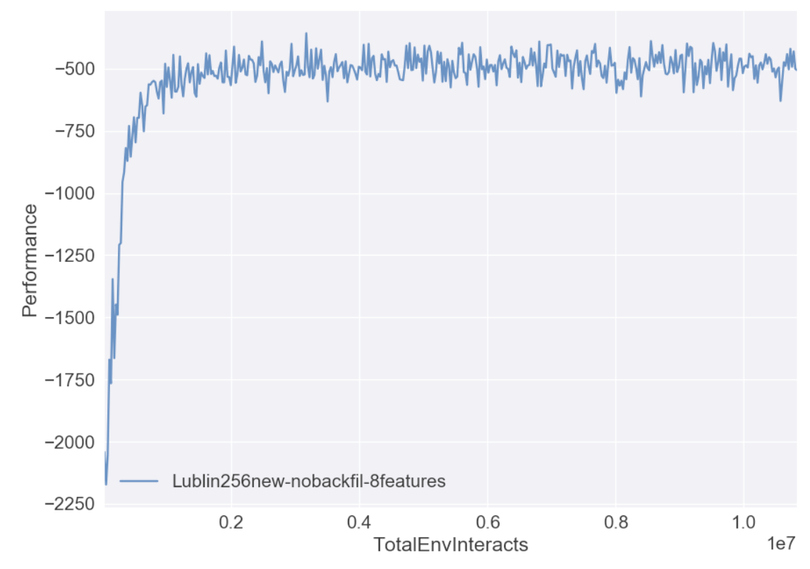 | 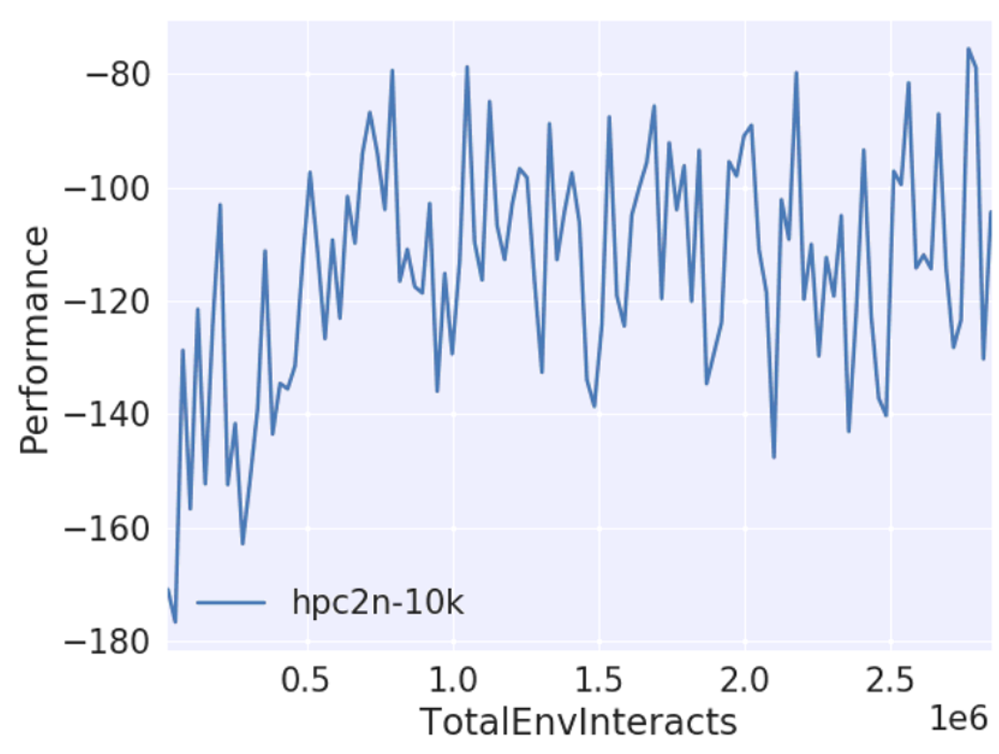 | 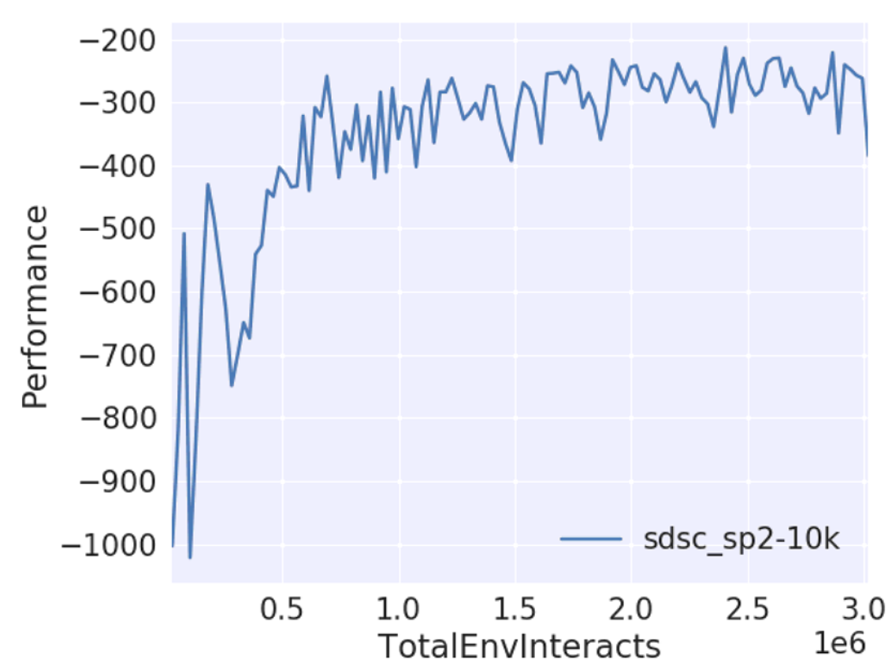 |
| Testing sequence=1024, with backfilling | 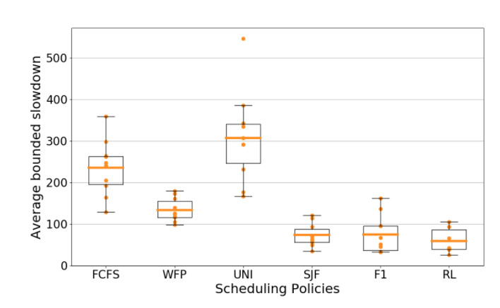     | 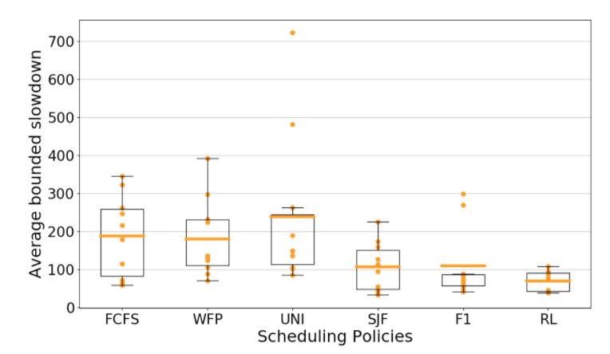     | 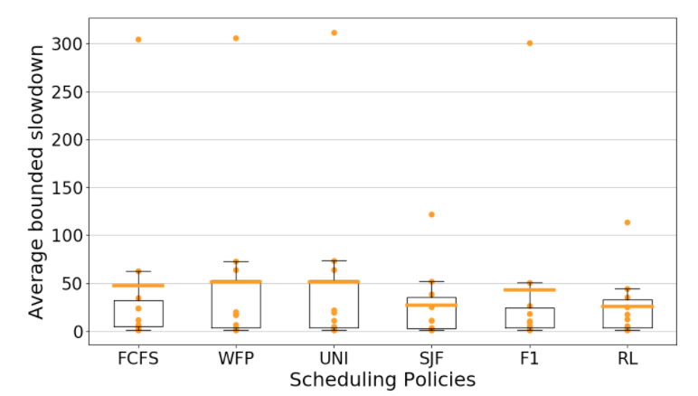     | 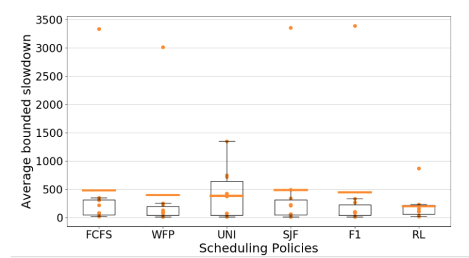     |
| Testing sequence=2048, with backfilling | 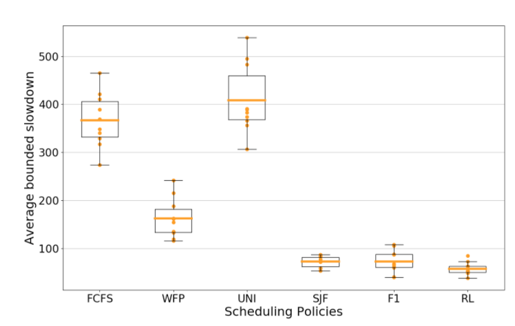     | 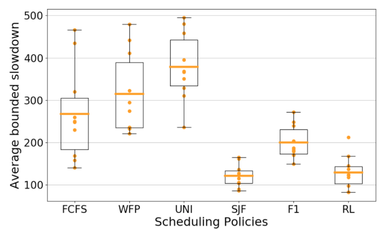     | 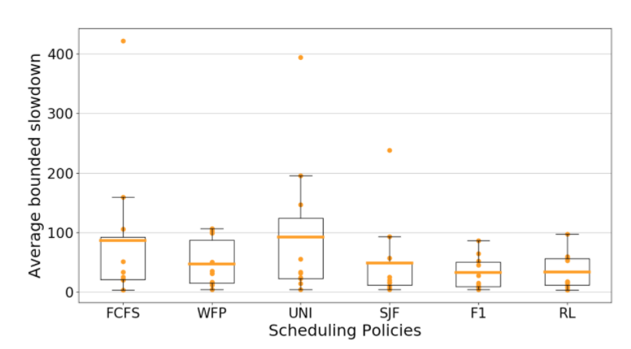     | 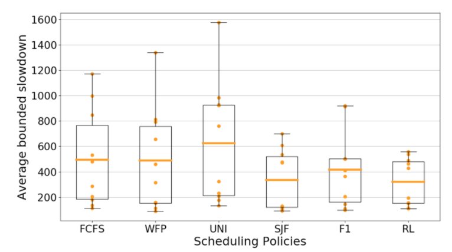     |
